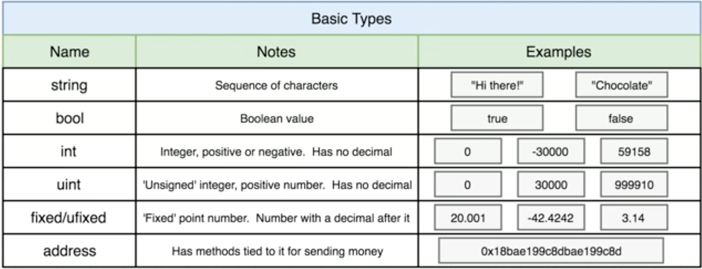
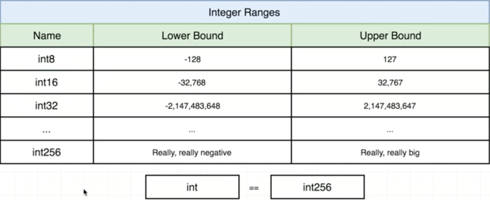
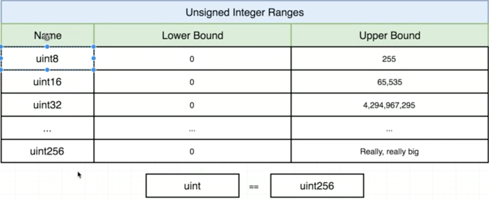
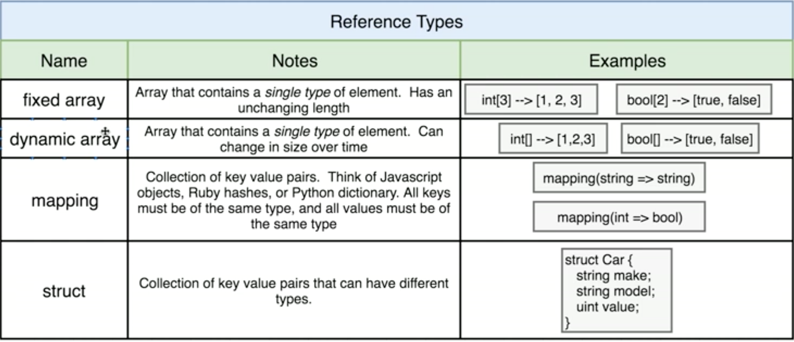
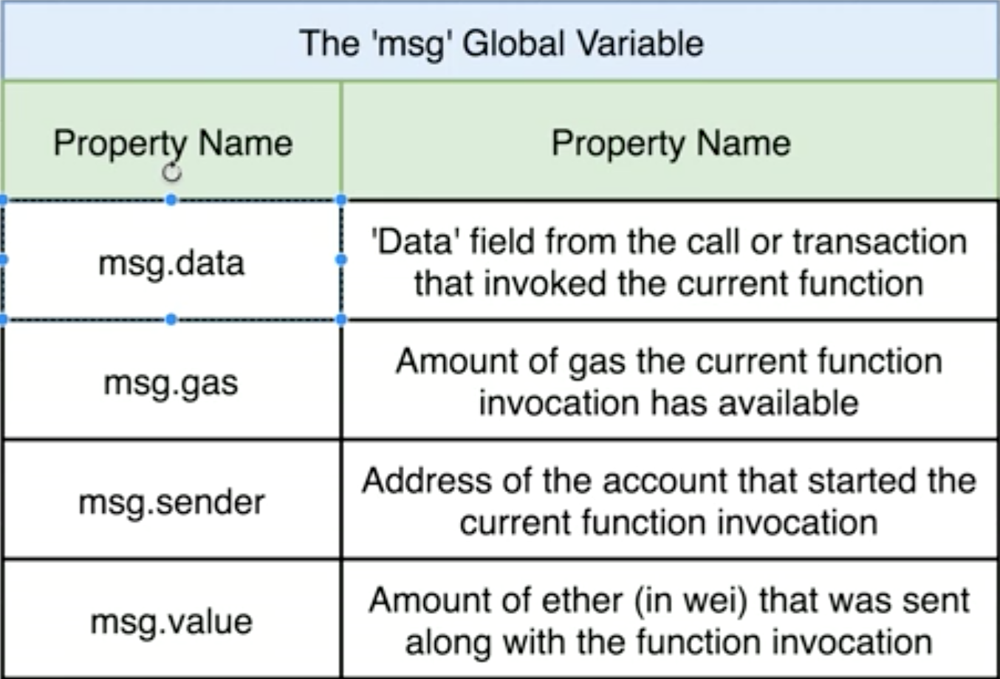

### General notes on smart contracts

* Smart contracts are “immutable”. Once they are deployed, their code is impossible to change, making it impossible to fix any discovered bugs.
* Strings are considered dynamic arrays in Solidity, because we are unable to retrieve nested arrays through web3, that means we are unable to fetch arrays of strings through web3
* This contract uses IPFS for all document and image storage
* Any time we deploy a contract, our contract is assigned a specific address on the blockchain

### What is a `confirmation date`?

* A confirmation date is a unix timestamp (in seconds) of when a government official, organization, or related agency last confirmed a particular user's, self-created profile. Even if a user were to update their profile afterwards, you could look at this timestamp, look at the state of the blockchain at that time, and conclude that the data contained in the block up to that timestamp has been confirmed.

### How does a Multihash Work?

* https://github.com/saurfang/ipfs-multihash-on-solidity

### Why use Bytes32 instead of Strings?

> The EVM has a word-size of 32 bytes, so it is "optimized" for dealing with data in chunks of 32 bytes. (Compilers, such as Solidity, have to do more work and generate more bytecode when data isn't in chunks of 32 bytes, which effectively leads to higher gas cost.)

### Things to research

* Lightning network
* Raiden
* Plasma

