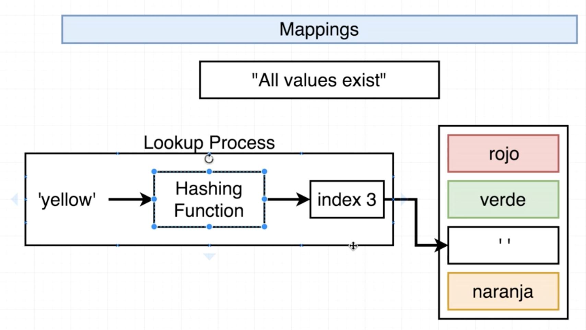
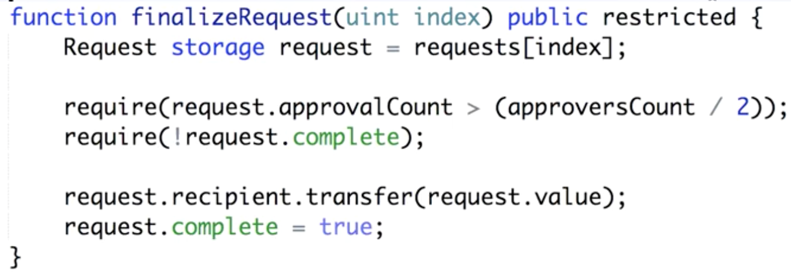

### General notes on proof of work consensus

* New transactions are broadcast to every single node
* All nodes collect new transactions into a block
* Every single node works on finding a proof of work for its block, this is to ensure than no one node is cheating
* Mining ensures a secure, tamper-resistant consensus
* When a proof of work is figured out by a node, it is broadcast out to the entire network
* The network accepts broadcasted blocks if they are valid
* Nodes then work on figuring out the next block in the chain
* Nodes only consider the longest chain to be valid
* A miner will generally list transactions by transaction cost (high to low) and include as many transactions as it can in a single block (incentivized by the additional gas cost / gas price)
* A block in Ethereum should be mined approximately every 10-19 seconds
* If a block is mined significantly faster than 10-19 seconds, the difficulty is increased, if a block is mined significantly slower, the difficulty is decreased automatically by the network

### General notes on Ethereum

* No more than about 18 million ether gets issued every year
* Ethereum uses the `Ethash` proof of work algorithm

### General notes on smart contracts

* Smart contracts are “immutable”. Once they are deployed, their code is impossible to change, making it impossible to fix any discovered bugs.
* Strings are considered dynamic arrays in Solidity, because we are unable to retrieve nested arrays through web3, that means we are unable to fetch arrays of strings through web3
* This contract uses IPFS for all document and image storage
* Any time we deploy a contract, our contract is assigned a specific address on the blockchain

### What is a `confirmation date`?

* A confirmation date is a unix timestamp (in seconds) of when a government official, organization, or related agency last confirmed a particular user's, self-created profile. Even if a user were to update their profile afterwards, you could look at this timestamp, look at the state of the blockchain at that time, and conclude that the data contained in the block up to that timestamp has been confirmed.

### How does a Multihash Work?

* https://github.com/saurfang/ipfs-multihash-on-solidity

### Why use Bytes32 instead of Strings?

> The EVM has a word-size of 32 bytes, so it is "optimized" for dealing with data in chunks of 32 bytes. (Compilers, such as Solidity, have to do more work and generate more bytecode when data isn't in chunks of 32 bytes, which effectively leads to higher gas cost.)

### Notes on Solidity mappings

* Keys are not stored in solidity mappings, we work with hash tables in Solidity, the key is first hashed using a hash function, and that hash is mapped to a predefined index value, which is then mapped to the actual value
* In mappings, values are not iterable
* A mapping is a reference type, and thus if there is a mapping in a struct definition, we do not have to initialize that mapping when we initialize that struct

### Notes on Solidity `memory` and `storage` keywords

* `memory` variables are temporary variables that exist only inside the calling function (they cannot be declared outside of one), they get wiped after the function exits and they are generally cheaper to use than storage variables,  this is used to hold temporary values. It is erased between (external) function calls and is cheaper to use than storage variables
* `storage`, where all the contract state variables reside, every contract has its own storage and it is persistent between function calls and quite expensive to use

### General Notes on Hot and Cold Storage

* The whole point of cold storage is to keep your assets in cold storage from being vulnerable to attacks should your hot storage be compromised
* Both hot and cold storage sides know their own secret keys of course, but they possess each other's addresses
* Cold storage is not online
* Because hot storage knows the addresses of the cold storage, the hot storage accounts can still send assets to the cold storage accounts even if the cold storage is offline
* Ideally, for security purposes, we want to use a fresh cold address each time we send assets from a hot storage account to a cold storage account

### Notes on Hierarchical Wallets

* Address generation information does not leak keys, so it can be freely distributed
* Bitcoin has ECDSA which supports hierarchical key generation
* Hierarchical address generation is performed on the hot side, while hierarchical key generation is performed on the cold side
* This whole setup allows us to have constant one-way communication from the hot side to the cold side without having constant connections from the cold side

### Operational Notes

* When deployed to the Rinkeby test network, each transaction takes roughly 15~30 seconds to execute, need to make sure that the UI has elements in place to let the user know that the transaction is in progress

### Things to research

* Lightning network
* Raiden
* Plasma

